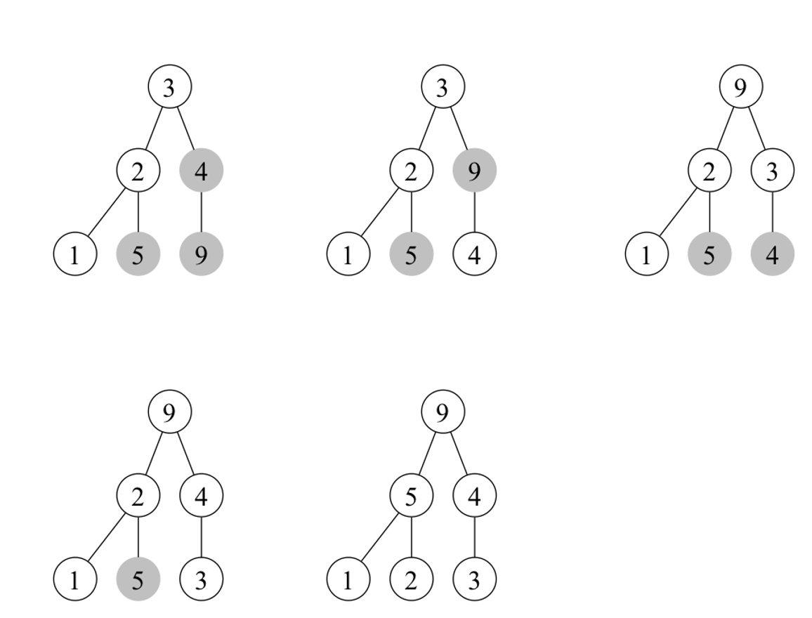
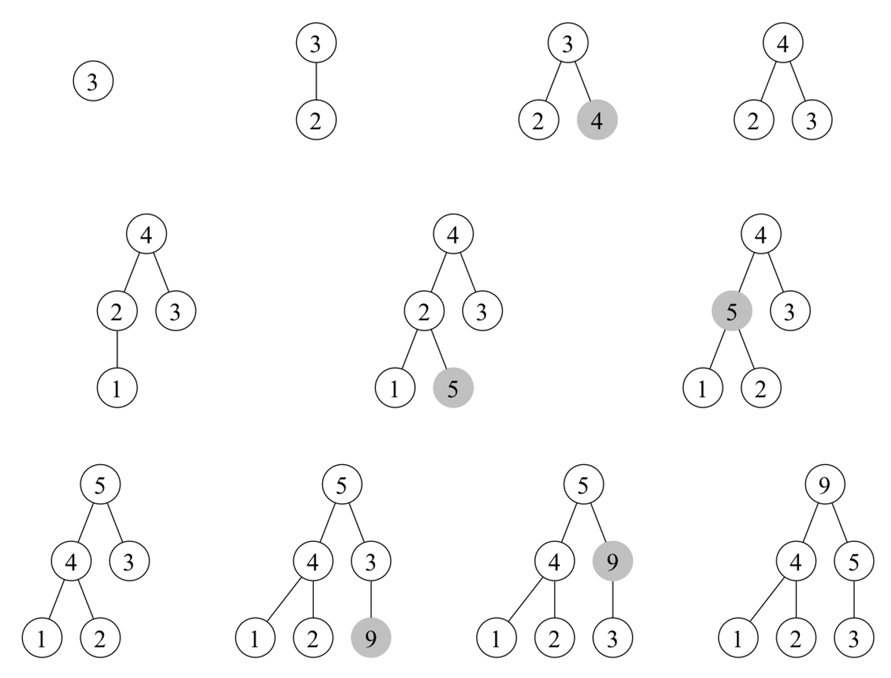

# 105-stl-algorithms
Fall/winter project to test out 'all' stl algorithms

Inspired by the 2018 cppcon talk "105 STL Algorithms in Less Than an Hour"
by Jonathan Boccara https://www.youtube.com/watch?v=2olsGf6JIkU

# Province of heaps

Heaps are ordered (but not necessarily sorted) structures that are compatible
with a vector. Nodes of a heap has two children nodes that both are smaller
(max heap) than the parent or bigger (min heap) than the parent.

In STL heaps can be constructed by initialisation from a vector or by pushing
elements onto an empty heap (or a combination). Note that these can result in
different heaps for the same input.

## std::make_heap

If we make a heap from the vector [3, 2, 4, 1, 5, 9], we first get a data
structure that does not respect the heap property. However after a few swap
operations, the order is restored.

The final heap has the order [9, 5, 4, 1, 2, 3]

## std::push_heap

If instead we start with an empty vector and sequentially push the values
[3, 2, 4, 1, 5, 9] onto the heap we keep maintaining the heap order.

The final heap has the order [9, 4, 5, 1, 2, 3]

## std::pop_heap

We can successively pop the top element of the heap using std::pop_heap(). This will
reestablish heap ordering, eventually resulting in sorting the heap elements.

Note that **std::pop_heap()** needs to be followed by **std::pop_back()** to remove the
previous largest value which is still in the array, but is now considered
outside the heap.

    loop:
      max = v.first();
      std::pop_heap(v.begin(), v.end());
      v.pop_back();

## std::sort_heap
Heaps can be sorted directly using **std::sort_heap()**.

Note that using sort heap on a vector is allowed but if it has not been
heap-ified by **std::make_heap()** the result will generally not be correct.
